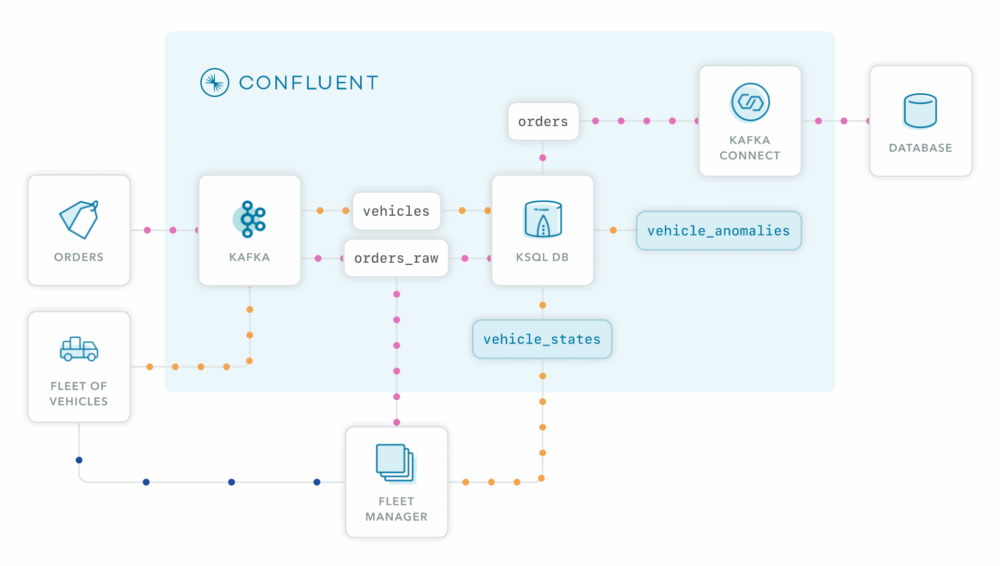

# Confluent Cloud Logistics ksqlDB Demo

This is a real-time logistics use case demo which mainly uses ksqlDB in Confluent Cloud for stream processing. It mainly uses two streams of data from orders and vehicle statuses. The demo showcases Confluent Cloud's features like:
- Real-time order tracking from joins on ksqlDB with streams and tables
- Masking data from customer orders
- Schema registry tags on PII columns
- Stream lineage showing the entire streaming flow
- Tracking vehicles on a map in real time

## Overall Architecture


## Stream Lineage in action!


## Real-time delivery tracking with ksqlDB


# Instructions

## Pre-requisites
- positionstack API Key (register at https://positionstack.com/)
- docker installed
- Confluent Cloud account
- ccloud CLI installed

To run this demo:

```
cd ccloud/ccloud-stack
./ccloud_stack_create.sh
```
