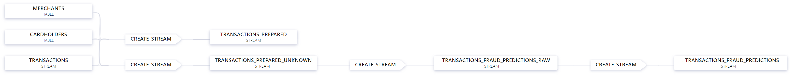
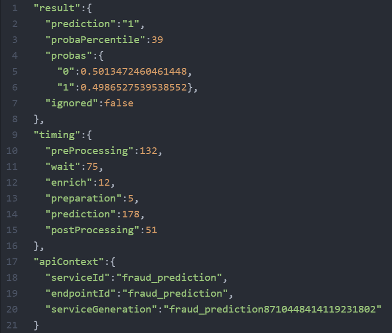

# ML Fraud Detection Demo (with Dataiku)

## Description
PLACEHOLDER TEXT
Credit to Jerrold for making the original version of this demo

__Features shown in this demo__
* ksqlDB UDFs
* Integration with ML/AI (Dataiku)
* Pre-built connectors (CDC from Confluent to Oracle, sink to MongoDB)
* Control Center UI including ksqlDB flow view
* Integrated connectors in ksqlDB

__Logical architecture__


__ksqlDB flow diagram__



## Setup
1. Connector files are downloaed and linked into ksqldb-server docker container via volume mount from Confluent Hub and unzip them into the `confluent-hub-components` folder. Connector versions indicated were tested and work, newer versions *should* also work.
    * confluentinc/kafka-coonect-oracle-cdc:1.1.2
    * mongodb/kafka-connect-mongodb:1.5.0
2. Unzip `dss/dss.zip` and place the contents into the `dss` folder. The resulting folder structure should be `dss/<stuff>` and not `dss\dss\<stuff>`.
    * Copy the Dataiku DSS license file (not included in this repo) into `dss/config/license.json`.
3. Unzip `oracle.zip` will place the contents into the `oracle` folder.

## Demo instructions
1. Run `start.sh` which will:
    * Run `docker-compose up -d`
    * Wait for ksqlDB to be ready to serve requests
    * Create Oracle DB tables (merchants, cardholders, transactions) and populate them with data
    * Setup oracle database into archive mode and logging, this you have to be done automatically, please do the steps mentioned in the output, the script will wait
    * Create CDC source connector to capture Oracle data into Kafka
    * Run ksqlDB queries from [ksql-queries.sql][1] to create tables and streams to enrich transactions to be loaded to MongoDB
    * Create sink connector to load enriched transactions into MongoDB for ML training
    * Install and start a Dataiku API node to serve fraud prediction queries against the trained ML model (previously saved in `fraud_prediction_v1.zip`)
    * Run ksqlDB queries from [ksql-queries2.sql][2] to run the trained fraud prediction model against STREAM `transactions_unknown` which contains all transactions without an authorization flag set
2. The results of the model are available in the `transactions_fraud_predictions_raw` (which has the result and metadata in a single string per the sample prediction below) and `transactions_fraud_predictions` (which only retains the prediction result and percentile) topics.
3. Based on the output, further queries are possible e.g. filtering for either prediction result, or for a certain percentile range etc.

__Sample prediction output__



## Test Generator
to generate a stream of transaction events (approved and not approved and also NULL records) please execute in Oracle:
```bash
sqlplus ordermgmt/kafka@localhost:1521/ORCLPDB1.localdomain
begin
transaction_generator;
end;
/
```
The generator will send every 5 seconds a new record.

You can stop the generator by just to an update
```bash
sqlplus ordermgmt/kafka@localhost:1521/ORCLPDB1.localdomain
update stop_generator set stop='Y';
commit;
```


## Versions
Currently uses (i.e. tested with):
* Dataiku Data Science Studio (DSS) 8.0.2
* CP 6.1.0 (except ksqlDB) - 6.0.1 also works
* ksqlDB and ksqlDB CLI 0.15.0 (cp-ksqldb 6.0.1 also works)
* Connectors (place in `confluent-hub-components`):
  * confluentinc/kafka-coonect-oracle-cdc:1.1.2
  * mongodb/kafka-connect-mongodb:1.5.0

[1]: ./ksql-queries.sql "ksql-queries.sql"
[2]: ./ksql-queries2.sql "ksql-queries2.sql"
