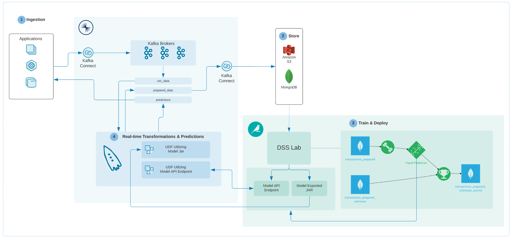
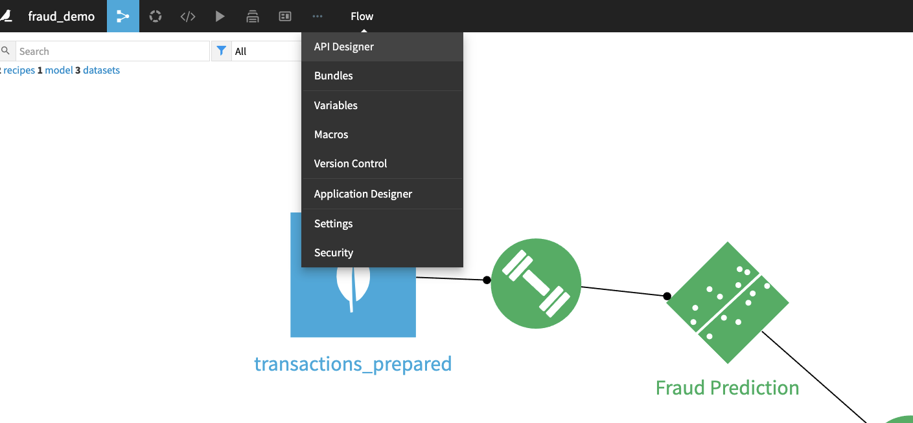

# ML Fraud Detection Demo (with Dataiku)

## Changes:

__docker-compose.yml__
* Updated Confluent images to 6.1.0
* Changed ksqlDB to use community image ksqldb-server:0.15.0
  * Removed monitoring interceptor configs (which are not on the community image)
  * Added configs required for embedded connect worker
  * mount Confluent Hub connector files from local copy rather than installing from within container
* Removed unused containers:
  * connect (unneeded, connectors run on ksqldb-server)
  * ksqldb-cli (unneeded, ksqldb-server has the CLI and removes need to juggle server and CLI versions)
  * rest-proxy (does not seem to be used)
* Removed curl commands from postgres, dataiku-dss and ksqldb-server and included in setup instructions (remove need to download every time demo is run, demo can now run offline assuming setup steps below are followed)

__sql.zip__
* Modify SQL files (cardholders.sql, merchants.sql, transactions_known.sql and transactions_unknown.sql) to insert all lines at once (clearer output from start script)
* Remove duplicate transaction ids from transactions_known.sql: 500005, 500015

__dss.zip__
* in `dss/config/users.json`: change `userProfile` to `DATA_SCIENTIST` (full access) to avoid permissions issues when starting API endpoint.

__start.sh__
* Added to automate startup and streamline docker-compose file.

## Description
PLACEHOLDER TEXT
Credit to Jerrold for making the demo

__Features shown in this demo__
* PLACEHOLDER TEXT

__Logical architecture__

## Setup
1. Download connector files from Confluent Hub and unzip them into the `confluent-hub-components` folder. Connector versions indicated were tested and work, newer versions *should* also work.
    * confluentinc/kafka-connect-jdbc:10.1.1
    * debezium/debezium-connector-postgresql:1.4.1
    * mongodb/kafka-connect-mongodb:1.5.0
2. Download https://jlaw-public.s3-ap-southeast-1.amazonaws.com/demos/confluent-dataiku-fraud-demo/fraud-demo-udf-1.0-jar-with-dependencies.jar and place it into the `ksqldb-udfs` folder.
3. Download https://jlaw-public.s3-ap-southeast-1.amazonaws.com/demos/confluent-dataiku-fraud-demo/dss.zip, unzip and place the contents into the `dss` folder. The resulting folder structure should be `dss/<29 sub-folders>` and not `dss\dss\<29 sub-folders>`.
    * Copy the Dataiku DSS license file (not included in this repo) into `dss\config\license.json`.

## Demo instructions
1. Run `start.sh`
2. Access the API Designer at http://localhost:10000/projects/FRAUD_DEMO/api-designer/fraud_prediction/endpoints/ and restart the API endpoint using the "actions" button in the top right. Note the port number, which is required for the next step.

3. Add queries from [manual-queries.sql][1] using ksqlDB CLI `docker exec -it ksqldb-server bash ksql http://ksqldb-server:8088`
4. TODO instructions for accessing C3, Dataiku UI etc.

## Versions
Currently uses (i.e. tested with):
* Dataiku Data Science Studio (DSS) 8.0.2
* CP 6.1.0 (except ksqlDB) - 6.0.1 also works
* ksqlDB and ksqlDB CLI 0.15.0 (cp-ksqldb 6.0.1 also works)
* Connectors (place in `confluent-hub-components`):
  * confluentinc/kafka-connect-jdbc:10.1.1
  * debezium/debezium-connector-postgresql:1.4.1
  * mongodb/kafka-connect-mongodb:1.5.0

[1]: ./manual-queries.sql "manual-queries.sql"
