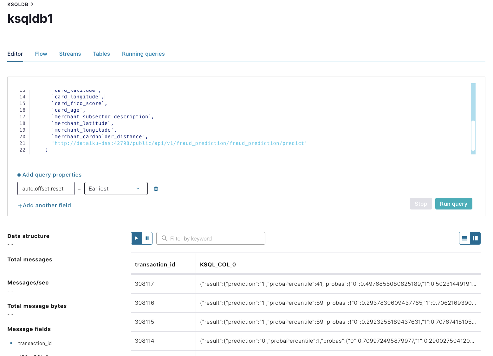

Confluent & Dataiku Real-time Fraud Predictions
===============================================

Created by Jerrold Law


1. `docker-compose -f docker-compose.yml up -d`

2. Enter your license key for Dataiku [http://localhost:10000](http://localhost:10000/ "http://localhost:10000/")

3. Enter the API Designer in the fraud\_demo project and start the API endpoint.


4. Use this KSQL query for real-time predictions. (Change port to what it assigned in step #3. Unfortunately this part cannot be automated until we get a proper license).

```
CREATE STREAM `transactions_fraud_predictions` AS
SELECT
  `transaction_id`,
  predictFraud(
    `purchase_date`,
    `card_id`,
    `merchant_id`,
    `merchant_category_id`,
    `item_category`,
    `purchase_amount`,
    `signature_provided`,
    `card_first_active_month`,
    `card_reward_program`,
    `card_latitude`,
    `card_longitude`,
    `card_fico_score`,
    `card_age`,
    `merchant_subsector_description`,
    `merchant_latitude`,
    `merchant_longitude`,
    `merchant_cardholder_distance`,
    'http://dataiku-dss:port/public/api/v1/fraud_prediction/fraud_prediction/predict'
  )
FROM `transactions_prepared_unknown`;
```


