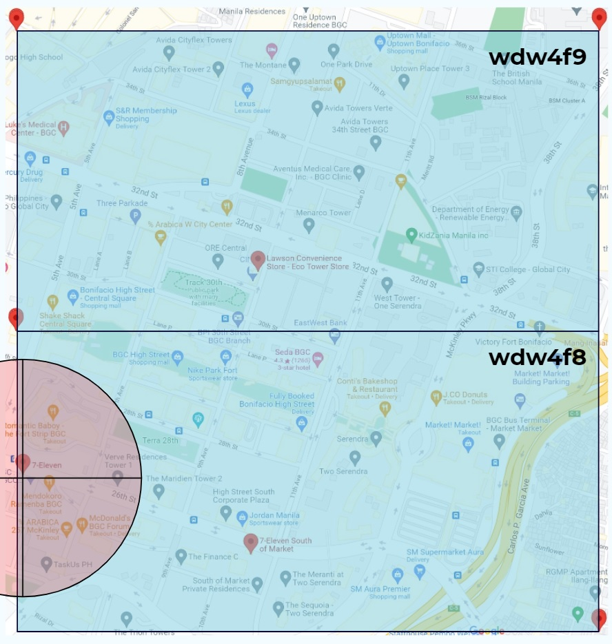
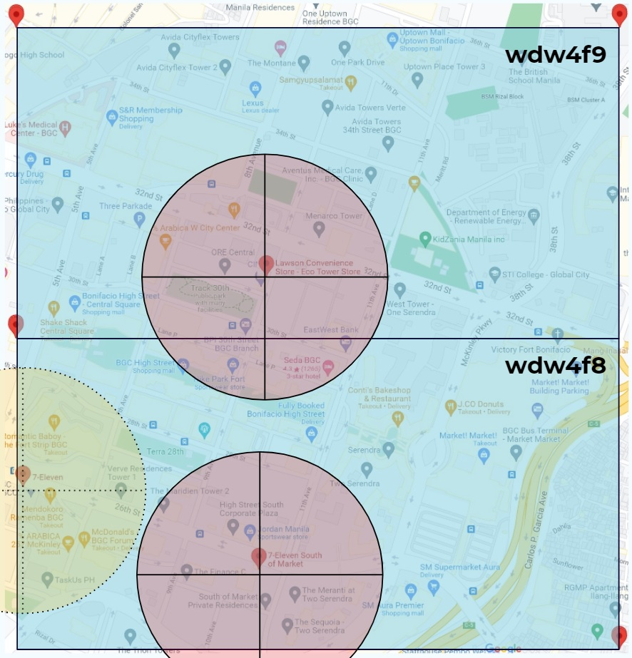
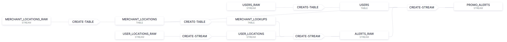

# Location Based Alerting Demo (geohash version)

## Description
This demo shows real time, personalized location based alerts in real time. User and merchant data from a database is joined against real time user locations (e.g. from mobile devices) to provide alerts when users pass within 200 meters of a participating merchant. In the demo, user locations are randomly generated within geohashes wdw4f8 and wdw4f9. We start with a single location in wdw4f8 (7-Eleven RCBC Center) and later add two more locations (one in eaach geohash) while removing the first. User locations are subdivided by geohash and users receive an alert if they come within 200m of any participating merchant (the red circle).

__Features shown in this demo__
* CDC from databases (MySQL)
* ksqlDB geodistance function
* UDFs (geohash function)
* Control Center UI including ksqlDB flow view
* Integrated connectors in ksqlDB

__Example use cases__
* Telcos - alert prepaid customers (potentially only those with low balance) to top up their prepaid cards
* Banking/digital wallets - alert users to top up their e-wallet balance

__Location map - initial__

__Location map - after update__

__Logical architecture__

__ksqlDB flow diagram__

## Setup
Download connector files from Confluent Hub and unzip them into [/confluent-hub-components][6] folder. Connector versions indicated were tested and work, newer versions *should* also work.
* debezium/debezium-connector-mysql:1.4.0
* confluentinc/kafka-connect-datagen:0.4.0
* confluentinc/kafka-connect-elasticsearch:11.0.6

## Demo instructions - fully automatic version
1. Run `start-full.sh` which will :
    * Run `docker-compose up -d`
    * Wait for ksqlDB to be ready to serve requests
    * Configure MySQL for Debezium CDC with single DB `user-data`
    * Create and populate `users` table with user details for 10 userids (1-10 inclusive)
    * Create and populate `locations` with single location (7-Eleven RCBC Center)
    * Create Debezium CDC source connector on `users` and `locations` tables
    * Create Datagen source connector to generate random locations (lat, long) within  (14.545898440, 121.047363285) and (14.556884760, 121.058349615) corresponding to the two geohashes on the location map, for userids between 1-10 inclusive
    * Add ksqlDB queries from [ksql-statements.sql][1]
    * Configure Elasticsearch index and import Kibana dashboard
2. Pause to view `output` topic. These records can be inserted into a template message by a microservice to provide personalized alerts. You can also view the ksqlDB flow diagram for a visualization of the data flow in ksqlDB. Kibana dashboards can be viewed at http://localhost:5601/app/dashboards (choose "Promo Monitoring")
3. Update locations and user levels by running [update.sh][2] which will add two more locations to the MySQL table of merchant locations, and remove the existing location. It will also change user level for userids 6-10 from Gold to Silver. You can show on the Kibana dashboard how alerts for the first location are no longer generated, with older alerts draining over time (if needed, change the time interval on the dashboard)
4. Stop the demo by running `docker-compose down`

## Demo instructions - semi automatic version
1. Run `start-semi.sh` which will :
    * Run `docker-compose up -d`
    * Wait for ksqlDB to be ready to serve requests
    * Configure MySQL for Debezium CDC with single DB `user-data`
    * Create and populate `users` table with user details for 10 userids (1-10 inclusive)
    * Create and populate `locations` with single location (Bonifacio-West)
    * Create Debezium CDC source connector on `users` and `locations` tables
    * Create Datagen source connector to generate random locations (lat, long) within  (14.546734278498768, 121.04761980788055) and (14.554372672056836, 121.0545504237969) corresponding to the black rectangle on the location map, for userids between 1-10 inclusive
2. Add queries from [ksql-statements.sql][1] using ksqlDB CLI `docker exec -it ksqldb-server bash ksql http://ksqldb-server:8088`:
    * L1: Reset offset to earliest
    * L3-4: Load user topic as STREAM `users_raw`
    * L6-13: Extract flattened user data and create lookup TABLE `users` from  `users_raw` STREAM
    * L15-16: Load merchant locations topic as STREAM `merchant_locations_raw`
    * L18-25: Extract flattened merchant locations and create lookup TABLE `merchant_locations` from  `merchant_locations_raw` STREAM
    * L27-33: Create lookup TABLE `merchant_lookups` with a list of merchant ids grouped by geohash from `merchant_locations`
    * L35-36: Load raw user locations topic as STREAM `user_locations_raw`
    * L38-46: Enrich raw user locations to `user_locations` STREAM by:
      * Casting latitude and longitude to 7 decimal places (approximately 11mm precision) illustrating `CAST` function and saving storage
      * Adding the geohash of each location (illustrating UDFs). This allows us to not have to lookup against every single (potentially 100s or 1000s) of merchant locations, instead matching only against merchants in the same geohash. Users can tweak the geohash precision to make each sub-area larger or smaller as required
    * L48-58: Creating a STREAM `alerts_raw` of alert candidates by joining `user_locations` STREAM to `merchant_lookups` TABLE by geohash and exploding the list of merchant ids such that every unique combination of userid and merchant id has one alert candidate
    * L60-74: Generating location based alerts in real time - Gold level users who pass within 200m of a merchant location will receive an alert - the `alerts_raw` STREAM is joined with TABLE `users` and `merchant_locations` so that the alert has fields with:
      * user first name (from `users`)
      * merchant description (from `merchant_locations`)
      * distance to merchant location (in meters)
3. These fields in the `output` STREAM can be inserted into a template message by a microservice to provide personalized alerts. You can also view the ksqlDB flow diagram for a visualization of the data flow in ksqlDB. Kibana dashboards can be viewed at http://localhost:5601/app/dashboards (choose "Promo Monitoring")
4. Add locations by running [update.sh][2] to add two more locations to the MySQL table of merchant locations, and remove the existing location. It will also change user level for userids 6-10 from Gold to Silver. You can show on the Kibana dashboard how alerts for the first location are no longer generated, with older alerts draining over time (if needed, change the time interval on the dashboard)
    * Data changes from external systems (MySQL) are captured in real time and can instantly be added to our running query to drive additional business value
5. Stop the demo by running `docker-compose down`

## Localization notes
This demo is based on an area in Manila in the Philippines. It can be localized for any location with the following steps:
* Select an area in which user locations should be generated, and get the latitude and longitude range that covers this area. Update L44-45 and L54-55 of [ksql-init.sql][4] with these values. The area should correspond to two geohashes.
* Select at least one merchant location in each geohash and get the latitude and longitude for each merchant location. Note that having locations within 400 meters of one another will have their alert radii overlap i.e. a single user may get more than one alert.
  * For the first location, update the description, area name and lat/long in L17 of [mysql-init.sql][5]
  * For subsequent locations, update the description, area name and lat/long in L7-8 of [update.sh][2].

## Versions
Currently uses (i.e. tested with):
* CP 6.2.0 (including ksqlDB and ksqlDB CLI)
* MySQL 8.0.19
* Connectors:
  * debezium/debezium-connector-mysql:1.4.0
  * confluentinc/kafka-connect-datagen:0.4.0
  * confluentinc/kafka-connect-elasticsearch:11.0.6
* UDFs: GEO_HASH from https://github.com/wlaforest/KSQLGeo

[1]: ./ksql-statements.sql "ksql-statements.sql"
[2]: ./update.sh "update.sh"
[4]: ./ksql-init.sql "ksql-init.sql"
[5]: ./mysql-init.sql "mysql-init.sql"
[6]: ./confluent-hub-components "confluent-hub-components"
