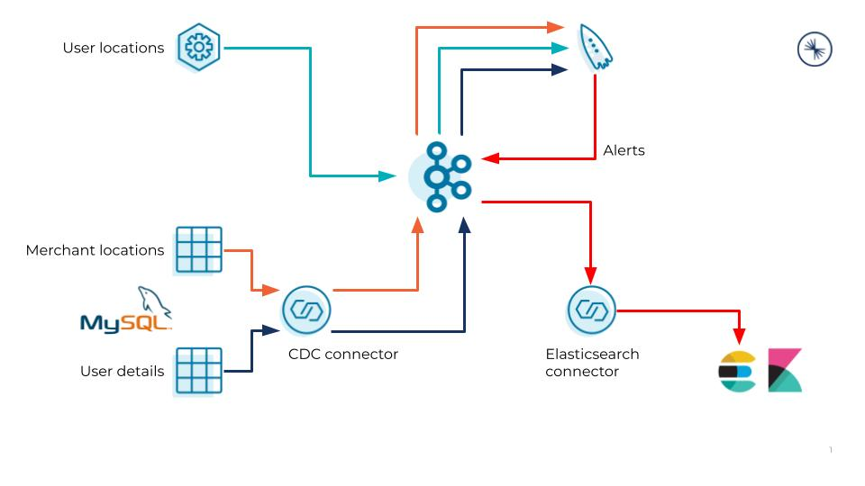

# Location Based Alerting Demo

## Description
This demo shows real time, personalized location based alerts in real time. User and merchant data from a database is joined against real time user locations (e.g. from mobile devices) to provide alerts when users pass within 200 meters of a participating merchant. In the demo, user locations are randomly generated within the black rectangle on the location map below. We start with a single location (Bonifacio-West) and later add two more locations (Bonifacio-South and Bonifacio-North). User locations are subdivided into grids corresponding to a ~430x430m square area around each merchant (the blue box) and users receive an alert if they come within 200m of the merchant (the red circle).

__Features shown in this demo__
* CDC from databases (MySQL)
* ksqlDB geodistance function
* Control Center UI including ksqlDB flow view
* Integrated connectors in ksqlDB

__Example use cases__
* Telcos - alert prepaid customers (potentially only those with low balance) to top up their prepaid cards
* Banking/digital wallets - alert users to top up their e-wallet balance

__Location map__

__Logical architecture__

__ksqlDB flow diagram__

## Setup
Download connector files from Confluent Hub and unzip them into the folders shown below. Connector versions indicated were tested and work, newer versions *should* also work.
* debezium/debezium-connector-mysql:1.4.0 - place in confluent-hub-components/debezium-connector-mysql
* confluentinc/kafka-connect-datagen:0.4.0 - place in confluent-hub-components/kafka-connect-datagen

## Demo instructions - fully automatic version
1. Run `start-full.sh` which will :
    * Run `docker-compose up -d`
    * Wait for ksqlDB to be ready to serve requests
    * Configure MySQL for Debezium CDC with single DB `user-data`
    * Create and populate `users` table with user details for 10 userids (1-10 inclusive)
    * Create and populate `locations` with single location (Bonifacio-West)
    * Create Debezium CDC source connector on `users` and `locations` tables
    * Create Datagen source connector to generate random locations (lat, long) within  (14.546734278498768, 121.04761980788055) and (14.554372672056836, 121.0545504237969) corresponding to the black rectangle on the location map, for userids between 1-10 inclusive
    * Add ksqlDB queries from [ksql-statements.sql][1]
2. Pause to view `output` topic. These records can be inserted into a template message by a microservice to provide personalized alerts. You can also view the ksqlDB flow diagram for a visualization of the data flow in ksqlDB.
3. Add locations by running [add-loc.sh][2] which will add two more locations to the MySQL table of merchant locations and update the ksqlDB queries from [ksql-statements-2.sql][3]
4. Stop the demo by running `docker-compose down`

## Demo instructions - semi automatic version
1. Run `start-semi.sh` which will :
    * Run `docker-compose up -d`
    * Wait for ksqlDB to be ready to serve requests
    * Configure MySQL for Debezium CDC with single DB `user-data`
    * Create and populate `users` table with user details for 10 userids (1-10 inclusive)
    * Create and populate `locations` with single location (Bonifacio-West)
    * Create Debezium CDC source connector on `users` and `locations` tables
    * Create Datagen source connector to generate random locations (lat, long) within  (14.546734278498768, 121.04761980788055) and (14.554372672056836, 121.0545504237969) corresponding to the black rectangle on the location map, for userids between 1-10 inclusive
2. Add queries from [ksql-statements.sql][1] using ksqlDB CLI `docker exec -it ksqldb-server bash ksql http://ksqldb-server:8088`:
    * L1: Reset offset to earliest
    * L3-4: Load user topic as STREAM `users_raw`
    * L6-13: Extract flattened user data and create lookup TABLE `users` from  `users_raw` STREAM
    * L15-16: Load merchant locations topic as STREAM `merchant_locations_raw`
    * L18-25: Extract flattened merchant locations and create lookup TABLE `merchant_locations` from  `merchant_locations_raw` STREAM
    * L27-28: Load raw user locations topic as STREAM `user_locations_raw`
    * L30-36: Enrich raw user locations to `user_locations` STREAM by:
      * Casting latitude and longitude to 7 decimal places (approximately 11mm precision) illustrating `CAST` function and saving storage
      * Inserting an `area` field that corresponds to grid names - in production, we would subdivide the coverage area into grids where each grid contains a single merchant. This allows us to not have to lookup against every single (potentially 100s or 1000s) of merchant locations. We start by assuming everyone is in the same grid as the single merchant (which is not the most efficient way of doing things) and refine this later in the demo.
    * L38-48: Generating location based alerts in real time - users who pass within 200m of a merchant location will receive an alert - the `user_locations` STREAM is joined with TABLE `users` and `merchant_locations` so that the alert has fields with:
      * user first name (from `users`)
      * merchant description (from `merchant_locations`)
      * distance to merchant location (in meters)
3. These fields in the `output` STREAM can be inserted into a template message by a microservice to provide personalized alerts.
    * By including user phone number from `users` TABLE, we could send SMS alerts
    * We could additionally filter by user level (from `users` TABLE) to send promotions only to Silver users for example, to push them to Gold status
4. Add locations by running [add-loc.sh][2] to add two more locations to the MySQL table of merchant locations and update the ksqlDB queries from [ksql-statements-2.sql][3]
    * Review L3-19 of [ksql-statements-2.sql][3] and explain how this illustrates:
      * Ability to update running queries in ksqlDB (note the persistent query ID remains the same as that from step 2)
      * Refining the grid assignment (`area` field in `user_locations` STREAM) using CASE statements - we could have done this from the start even when we had a single location, saving some processing by not having to calculate distance for users outsite the grid who will definitely not be within 200m of the merchant
      * You can add a single location at a time, e.g. remove L15-17 of [ksql-statements-2.sql][3] if you are adding only Bonifacio-South first.
    * Data changes from external systems (MySQL) are captured in real time and can instantly be added to our running query to drive additional business value
5. Stop the demo by running `docker-compose down`

## Localization notes
This demo is based on an area in Manila in the Philippines. It can be localized for any location with the following steps:
* Select an area in which user locations should be generated, and get the latitude and longitude range that covers this area. Update L44-45 and L54-55 of [ksql-init.sql][4] with these values. The area should be around 600+ meters on each side.
* Select at least one merchant location in the above area and get latitude and longitude for each merchant location. Avoid having locations within 400 meters of one another otherwise their alert radii will overlap.
  * For the first location, update the description, area name and lat/long in L17 of [mysql-init.sql][5]
  * For subsequent locations, update the description, area name and lat/long in L7-8 of [add-loc.sh][2].
  * Update L9-18 in [ksql-statements-2.sql][3] with the area names of your locations if you use more than one location. The lat/long ranges are defined by adding/subtracting 0.0019482 (approx. 216 meters) from the respective location's lat/long.

## Versions
Currently uses (i.e. tested with):
* CP 6.1.0 (except ksqlDB)
* ksqlDB and ksqlDB CLI 0.15.0
* MySQL 8.0.19
* Connectors:
  * debezium/debezium-connector-mysql:1.4.0 - place in confluent-hub-components/debezium-connector-mysql
  * confluentinc/kafka-connect-datagen:0.4.0 - place in confluent-hub-components/kafka-connect-datagen

[1]: ./ksql-statements.sql "ksql-statements.sql"
[2]: ./add-loc.sh "add-loc.sh"
[3]: ./ksql-statements-2.sql "ksql-statements-2.sql"
[4]: ./ksql-init.sql "ksql-init.sql"
[5]: ./mysql-init.sql "mysql-init.sql"
