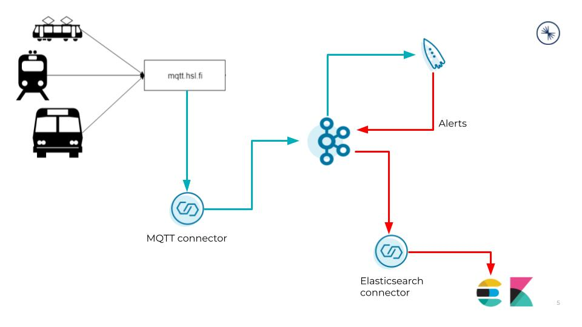
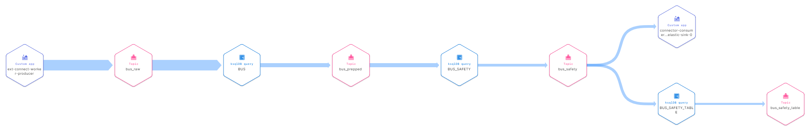
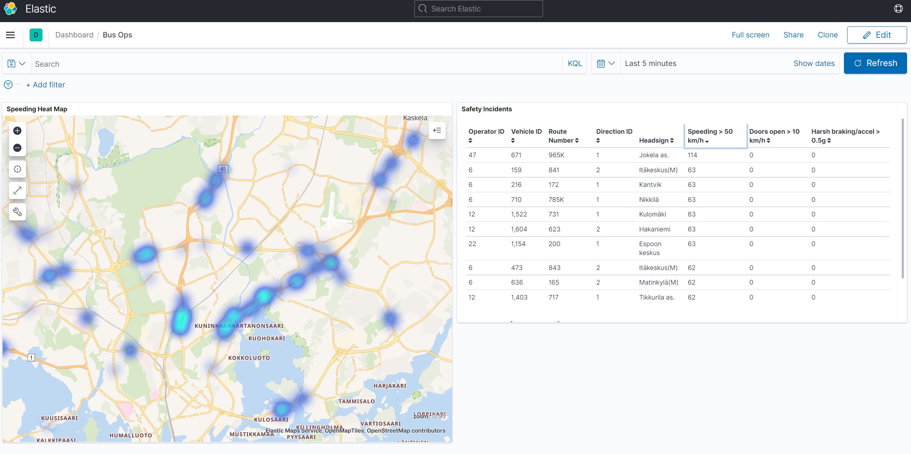

# IoT Real Time Alerting Demo (Confluent Cloud version)

## Description
This demo shows real time alerts on IoT data. Location data from Helsinki's [High-frequency positioning API][1] is ingested to Confluent Cloud and processed using managed ksqlDB to identify safety issues (e.g. speeding) in real time.

__Features shown in this demo__
* MQTT integration
* Stream lineage in Confluent Cloud
* Fully managed ksqlDB and Schema Registry

__Logical architecture__

__Stream lineage diagram__

## Setup
Download connector files from Confluent Hub and unzip them into the `/confluent-hub-components` folder. Connector versions indicated were tested and work, newer versions *should* also work.
* confluentinc/kafka-connect-elasticsearch:11.0.6

## Demo instructions
1. Set desired Confluent Cloud parameters using variables. To view available cloud providers and regions, use `confluent kafka region list`.
    * `CLUSTER_CLOUD`: defaults to "gcp"
    * `CLUSTER_REGION`: defaults to "asia-southeast1"
    * `KSQL_CSU`: number of ksqlDB CSUs, defaults to 1
2. Run `start.sh` which will :
    * Create a Confluent Cloud stack using ccloud-stack utility (currently hard coded to a cluster in GCP asia-southeast1, you can edit [start.sh L7-L8][2] to change this)
    * Start a self-managed Connect worker, Elasticsearch and Kibana on docker locally
    * Wait for managed ksqlDB cluster to be UP
    * Add ksqlDB queries from [ksql-statements.sql][2]
    * Create (fully managed) source connector from MQTT and (self managed) sink connector to Elasticsearch
    * Configure Elasticsearch index and import Kibana dashboard
3. Note the output of the script, particularly the line saying `export SERVICE_ACCOUNT_ID=nnnnnn`. You will need to run this export command to clean up the Confluent Cloud resources at the end of the demo.
4. Pause to view `bus_safety` topic. These records can be used for real-time monitoring and alerting, e.g. alerting via in-vehicle computer, aggregating by operator for enforcement purposes, and centralized monitoring. You can also view the stream lineage diagram for a visualization of the data flow in ksqlDB. A Kibana dashboard example of centralized monitoring can be viewed at http://localhost:5601/app/dashboards (choose "Bus Ops").

__Sample dashboard__

4. Stop the demo by running in this order:
    * The command from step 2, i.e. `export SERVICE_ACCOUNT_ID=nnnnnn`
    * `stop.sh`, which will stop the local containers and destroy the Confluent Cloud resources

## Versions
Currently uses (i.e. tested with):
* CP 6.2.0 (self managed Connect worker)
* Connectors:
  * confluentinc/kafka-connect-elasticsearch:11.0.6

[1]: https://digitransit.fi/en/developers/apis/4-realtime-api/vehicle-positions/ "https://digitransit.fi/en/developers/apis/4-realtime-api/vehicle-positions/"
[2]: ./start.sh#L7-L8 "start.sh"
[3]: ./ksql-statements.sql "ksql-statements.sql"
