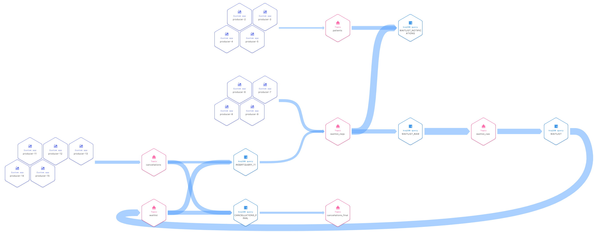

# Waitlist Demo

## Description
This demo implements a simple real time waitlist with integration to existing appointments systems (i.e. cancellations) and user notification. Users can add or remove waitlist requests for a specific time slot, or cancel an existing appointment. Any cancellations will be matched to the waitlist and the slot will be given to the first user in the waitlist if one exists. Only cancellations where no user is waiting will be passed through to backend systems to release the time slot.

__Features shown in this demo__
* ksqlDB queries forming a feedback look (note that this currently breaks the ksqlDB flow diagram in Control Center and Confluent Cloud UI, but not the Stream Lineage diagram in the Cloud UI)

__Example use cases__
* Healthcare appointments management
* Airlines flight waitlisting

__Stream lineage diagram__

## Setup
Run `start.sh`, wait for it to complete and prepare three other screens/ terminals to run the following ksqlDB queries:
* `SELECT * FROM waitlist EMIT CHANGES;` - this is the table of waiting users.
* `SELECT * FROM cancellations_final EMIT CHANGES;` - this is a stream of cancellations that are not matched to a waitlisted user, and therefore should flow on to backend systems to release the time slot.
* `SELECT * FROM waitlist_notifications EMIT CHANGES;` - this is a stream of notifications to users who have received their waitlisted time slot.
Once you are ready, run `demo.sh` and follow the instructions on the screen.

## Demo instructions (running demo.sh)
1. The demo script will start by inserting a single user (ID S1111111A) onto the waitlist for 15 Jan 2022, 0230 UTC. You will see a single output line for `waitlist` but nothing on `cancellations_final` or `waitlist_notifications`.
2. Press enter to insert a second user (ID S2222222B) into the waitlist for the same time slot. You will see the output for `waitlist` update to show users 1 and 2 in order. Press enter again, and observe that the waitlist now has users 1 to 3 in numberical order.
3. Press enter to simulate user 2 cancelling their waitlist request. The `waitlist` table will update to show users 1 and 3 in that order.
4. Press enter to simulate user 2 changing their mind and registering for the waitlist again. Observe that the user order is now 1 > 3 > 2.
5. Moving on to cancellations - press enter to send a cancellation matching the waitlisted time slot. This slot will be given to user 1 (first in queue). Observe that `waitlist` updates to have users 3 and 2 in that order. Nothing appears in `cancellations_final` because the cancelled slot is taken by user 1, and a notificatoin is sent in `waitlist_notifications` to user 1 with their name and mobile number (e.g. for a SMS gateway to process).
6. Press enter and wait a few seconds, two more cancellations for the same time slot will be sent and the slots matched to users 3 and then user 2, resulting in an empty `waitlist`, two more `waitlist_notifications` but still nothing in `cancellations_final`.
7. Showing unmatched cancellations - press enter to send cancellations for two different time slots. One is for a time slot that previously had waitlisted users but no longer has any users waiting (15 Jan 2022, 0230 UTC) and one for a time slot that never had any users waiting (14 Jan 2022, 0230 UTC). Both will flow through to `cancellations_final` because they do not match any waitlisted slots, and should therefore flow on to backend systems to release the cancelled slots.
8. Stop the demo by running `docker-compose down`

## Versions
Currently uses (i.e. tested with):
* CP 6.2.0 (including ksqlDB)
